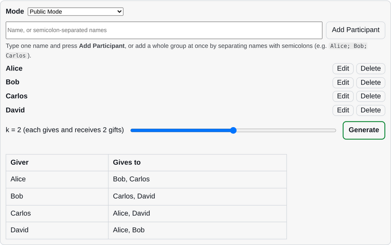
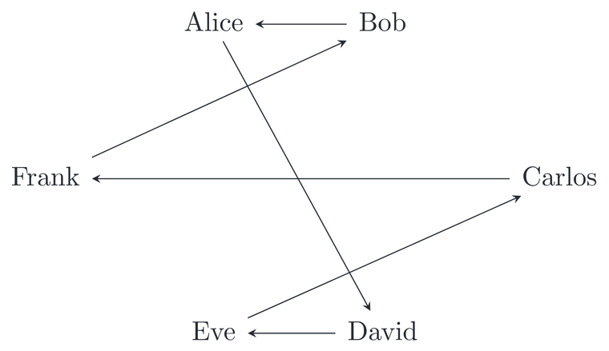
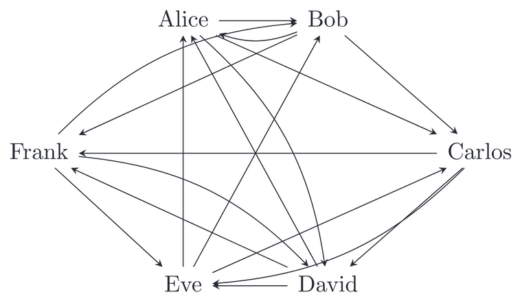
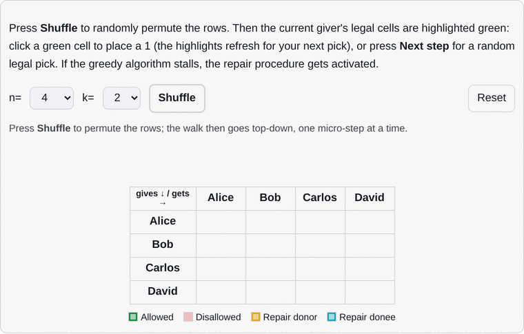
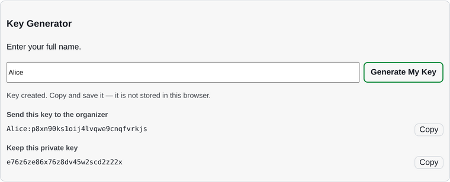

<div align="center">

# Gift Exchange: k Secret k Santa

**A retry-free generator for $k$-fold gift exchanges: everyone gives $k$ gifts and receives $k$ gifts, with no self-loops and no doubled arrows.**

[](LICENSE)
[](https://aryayae.com/k-fold-gift-exchange/)
[](#tests)

</div>

Classic Secret Santa assigns each person one recipient (and one giver).  This tool
generalizes that to a **$k$-fold gift exchange**: among $n$ participants, each person
gives gifts to $k$ distinct others and receives from exactly $k$ distinct others,
for any $1 \le k \le n-1$.  The algorithm generates the gift assignment in two stages: first with a greedy pass, and then with an augmenting-path repair step if the greedy pass gets stuck.

It is a dependency-free ES-module web app.  Open it, type the participants, pick $k$,
and generate.  Three output modes are supported:

| Mode | What the organizer sees and shares |
|---|---|
| **Public Mode** | The assignment table, in the clear. |
| **Secret Mode (Trusted Organizer)** | A public message of additive one-time-pad ciphertexts plus one private key per person. The organizer holds every key. |
| **Secret Mode (Double Blind)** | ElGamal public-key encryption; each person generates their own keypair and keeps the private half, so even the organizer cannot read a row. |

*Disclaimer: This is primarily an educational demonstration, not professional grade cryptography.  The ElGamal encryption scheme does not authenticate who a public key belongs to, and the organizer's browser internally stores the gift assignments before they get encrypted.*

## Try it

| | |
|---|---|
| **Live** | **<https://aryayae.com/k-fold-gift-exchange/>** (GitHub Pages) |
| **Local** | `python3 -m http.server 8000` in this folder, then open <http://localhost:8000/> |

> The widget is an ES-module app, so it must be served over **HTTP** instead of directly as a `file://` path.

The tool is split across three pages:

- `index.html` - the generator (and the exposition below it);
- `decrypt/` - participants paste the public message and their private key to see their own recipients;
- `keygen/` - in double-blind mode, participants generate a keypair and copy their `Name:PublicKey` share line.

<p align="center">
  <picture>
    <source media="(prefers-color-scheme: dark)" srcset="assets/img/readme/generator_dark.png">
    
  </picture>
</p>

## The graph theory

A gift exchange is a directed graph: an arrow $i \to j$ means person $i$ gives a gift to
person $j$.  The desired object is a **$k$-regular directed graph without self-loops**, or
equivalently an $n \times n$ adjacency matrix with every row sum and every column sum
equal to $k$ and all diagonal entries equal to 0.

<p align="center">
  <picture>
    <source media="(prefers-color-scheme: dark)" srcset="assets/img/readme/graph_one_component_dark.png">
    
  </picture>
  <picture>
    <source media="(prefers-color-scheme: dark)" srcset="assets/img/readme/graph_three_fold_dark.png">
    
  </picture>
</p>

A 1-fold exchange ($k=1$, left) is a single cycle; the 3-fold example ($k=3$, right) is
what the generator produces for $n=6$: every row and column sums to 3 and the diagonal
is empty.

## The algorithm

The generator makes one pass over the givers, filling each giver's row greedily with
recipients who still have spare capacity.  If a giver runs out of legal recipients, a
`repair` step creates a chain of edge donations to free up a slot for the stuck giver's row.  The `index.html` page includes a
step-by-step visualization of both the greedy pass and the repair chain.

<p align="center">
  <picture>
    <source media="(prefers-color-scheme: dark)" srcset="assets/img/readme/alg_repair_dark.gif">
    
  </picture>
</p>

*The walk above is the $n=4$, $k=2$ case, one micro-step per frame.  After seven greedy
placements the final row has no legal recipient left, so the **repair** phase reroutes a
single existing edge, freeing a
slot for the last row to be filled.*

## The cryptography

**Trusted Organizer.** A giver's $k$ recipient indices are encoded as an $n$-bit mask
$X \in [0, 2^n)$; the tool picks a secret offset $b_i$ modulo $d = 2^n + 1$ and
publishes $c_i = (X + b_i) \bmod d$. Because $b_i$ is uniform, each $c_i$ is a perfect
one-time pad of its row. The key `a<i><b><cc>` carries the giver index, the offset in
base 36, and a two-character checksum.  To decrypt, one calculates $X = (c_i - b_i) \bmod d$.

**Double Blind.** A hardcoded 128-bit safe prime $p = 2q+1$ and a generator $g$ define
ElGamal over $(\mathbb Z/p)^\times$.  Each participant picks a private exponent $x$ and
publishes $y = g^x \bmod p$. Each 0/1 entry is encrypted as a pair $(g^r,\ \tilde m y^r)$
with $\tilde m = (m+1)2^{64} + r'$ for a random 64-bit $r'$; only the holder of $x$ can
recover $m$.

<p align="center">
  <picture>
    <source media="(prefers-color-scheme: dark)" srcset="assets/img/readme/keygen_dark.png">
    
  </picture>
</p>


## Repository layout

| Path | Role |
|---|---|
| `index.html` | Generator widget plus the graph-theory, algorithm, and cryptography exposition. |
| `decrypt/index.html` | Reveal panel (`#ge=...&k=...` links auto-fill it). |
| `keygen/index.html` | Double-Blind keypair generator. |
| `assets/js/giftexchange/core.js` | The $k$-regular digraph construction (`generateAssignment`, `validateAssignment`). |
| `assets/js/giftexchange/crypto.js` | Row codec, additive one-time pad, ElGamal, token/message codecs. |
| `assets/js/giftexchange/app.js` | Generator UI wiring. |
| `assets/js/giftexchange/reveal.js` | Decrypt-page UI. |
| `assets/js/giftexchange/keygen.js` | Key-generator page UI. |
| `assets/js/giftexchange/viz.js` | Step-through visualization of the greedy + repair passes. |
| `assets/css/giftexchange.css` | Widget styling (light/dark aware). |
| `assets/css/site.css`, `assets/js/theme.js` | Page chrome and the shared light/dark theme. |

## Tests

The repository ships the Node harness used for the cryptography.  It has no
dependencies and runs on plain Node (v12+).

```bash
bash tests/run.sh   # copies the live crypto module next to the harness and runs it
```

It checks the additive round-trip for $2 \le n \le 20$, ElGamal round-trips, wrong-key
rejection, the row codec edge cases, and the token/message codecs.

## Updates

This repository is the source of truth for the widget: the
`assets/js/giftexchange/` modules, `assets/css/giftexchange.css`, the
`assets/img/gift_exchange/` diagrams (built from `tools/diagrams/`), the
`tests/` harness, and the page markup in `index.html` / `decrypt/` / `keygen/`
are all authored here.  The copy on the author's personal website is a
downstream mirror: a sync script there pulls these in and re-runs its crypto
gate, so the two stay in lock-step.

## Author

**Arya Yae**.  Questions, corrections and pull requests welcome.

## License

Released under the [MIT License](LICENSE).
